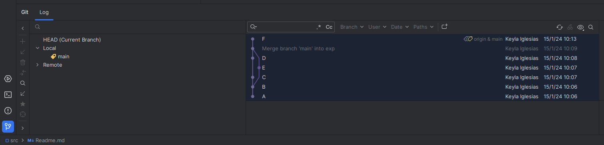

# RAMAS
## Cómo crear una rama?

Desde terminal: 

**git branch (nombre de la rama)**

Ver cuantas ramas se dispone: 

**git branch**

Cambiar de rama:

**git checkout (nombre de la rama)**

Merge:

**Git>Clic derecho en rama> Merge (nombre de la rama A) into (nombre de la rama B)>Merge>Apply**

De tal forma que quede así: 

